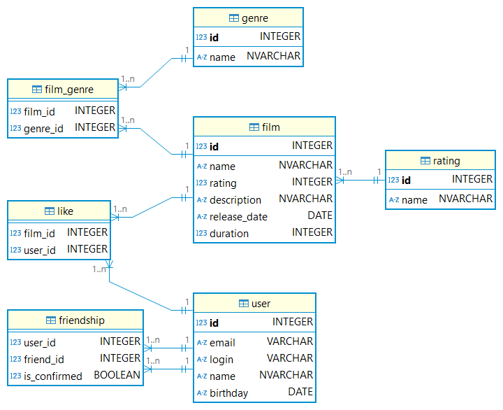

# java-filmorate

Репозиторий учебного проекта курса Java-разработчик Yandex Practicum

## Схема БД

## Описание таблиц

### users

Содержит информацию о пользователях.

| Поле     | Тип                  | Описание                  |
|----------|----------------------|---------------------------|
| id       | integer not null, pk | Уникальный идентификатор  |
| email    | varchar not null     | Адрес электронной почты   |
| login    | varchar not null     | Логин пользователя        |
| name     | nvarchar(128)        | Имя пользователя          |
| birthday | date                 | Дата рождения             |

### friendship

Содержит информацию о друзьях пользователей.

| Поле         | Тип                        | Описание                                      |
|--------------|----------------------------|-----------------------------------------------|
| user_id      | integer not null, fk users | Пользователь, ссылка на поле id таблицы users |
| friend_id    | integer not null, fk users | Друг, ссылка на поле id таблицы users         |      
| is_confirmed | boolean                    | Признак подтверждённой дружбы                 | 

### genre

Содержит информацию о жанрах фильмов.

| Поле | Тип                   | Описание                 |
|------|-----------------------|--------------------------|
| id   | integer not null, pk  | Уникальный идентификатор |
| name | nvarchar(64) not null | Наименование жанра       |

### rating

Содержит информацию о возрастных рейтингах фильмов.

| Поле | Тип                  | Описание                 |
|------|----------------------|--------------------------|
| id   | integer not null, pk | Уникальный идентификатор |
| name | integer(16) not null | Наименование рейтинга    |

### film

Содержит информацию о фильмах.

| Поле         | Тип                         | Описание                                           |
|--------------|-----------------------------|----------------------------------------------------|
| id           | integer not null, pk        | Уникальный идентификатор                           |
| name         | nvarchar(64) not null       | Возрастной рейтинг, ссылка на поле id таблицы mpaa |
| rating       | integer not null, fk rating | Название фильма                                    |
| description  | nvarchar(200)               | Описание фильма                                    |
| release_date | date                        | Дата выхода                                        |
| duration     | integer                     | Длительность фильма в минутах                      |

### film_genre

Содержит информацию о жанрах присвоенных фильмам.

| Поле     | Тип                         | Описание                               |
|----------|-----------------------------|----------------------------------------|
| film_id  | integer not null, fk film   | Фильм, ссылка на поле id таблицы films |
| genre_id | integer not null, fk genre  | Жанр, ссылка на поле id таблицы genre  |

### likes

Содержит информацию о лайках, поставленных пользователями на фильмах.

| Поле    | Тип                       | Описание                                      |
|---------|---------------------------|-----------------------------------------------|
| film_id | integer not null, fk film | Фильм, ссылка на поле id таблицы films        |
| user_id | integer not null, fk user | Пользователь, ссылка на поле id таблицы users |