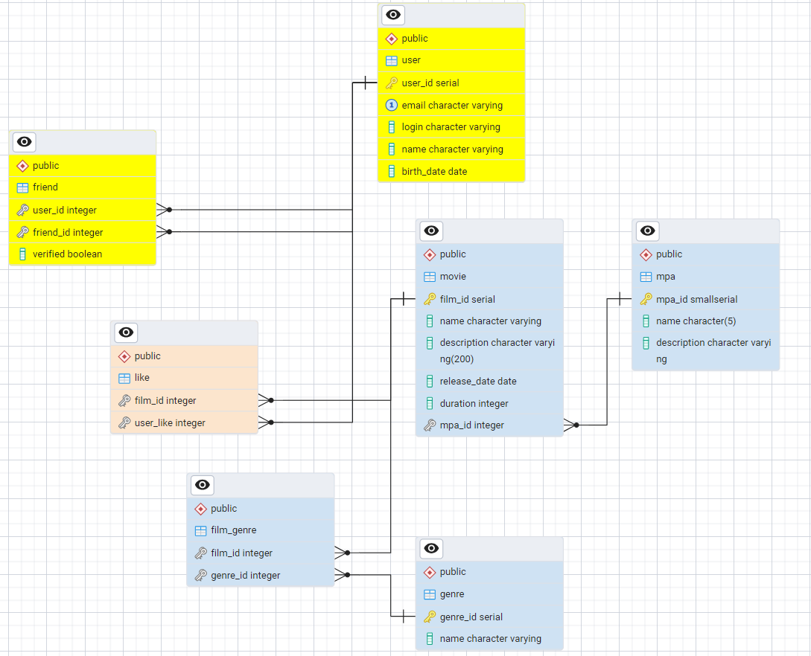

# java-filmorate
Template repository for Filmorate project.

### Техническое задание (спринт № 10)

## Модели данных
* добавлен класс Film
* добавлен класс User

Стандартные методы классов реализованы с помощью аннотации `@Data` библиотеки Lombok

## Хранение данных

Хранение данных реализовано в памяти через специализированный контроллер, помеченный аннотацией `@Repository`

## REST-контроллеры

Реализовано 2 контроллера `FilmController` и `UserController`

## Валидация

Валидация полей реализована с помощью аннотаций `@NotBlank`, `@Size`, `@Positive`, `@Email`, `@Pattern(regexp = "^\\S+$")`, `@Past`

Для валидации правила - _"дата релиза — не раньше 28 декабря 1895 года"_ реализована собственная аннотация `@MinDate`

## Логирование
Создание логера через аннотацию `@Slf4j` библиотеки Lombok

### Техническое задание (спринт № 11)

## Архитектура
Переработана архитектура:
* Взаимодействие с репозиториями реализовано через общий интерфейс
* Репозитории распределены по отдельным (своим) пакетам
* Контроллеры теперь зависимы от сервисов, сервисы от репозиториев
* Обработка исключений вынесена в отдельный `@RestConrollerAdvice`

## Новая логика
Реализованы новые компоненты - сервисы для работы с моделями `User` и `Film`, 
аннотированы `@Service`

В модель данных добавлены свойства `friends` и `likes` для `User` и `Film` соответственно

Добавлены новые аннотации `@FilmIDExists` и `@UserIDExists` для валидации передаваемых
`id` на существование. При этом в валидаторы внедрены зависимости от репозиториев
через методы с помощью аннотации `@Autowired`

## Полный REST
Добавлены необходимые ендпоинты согласно ТЗ, отрегулированы необходимые коды
ответов сервера

## Дополнительное логирование
Интегрирован стартер библиотеки Logbook в Spring Framework для
выведения в лог информации об HTTP-запросах и ответах.

## Тестирование
Текущий проект протестирован с помощью нового набора тестов через Postman

### Промежуточное задание (спринт № 12)

## Доработка модели
Добавлены дополнительные свойства в модель данных (`Film`, `User`)

## Создание схемы базы данных
Вариант схемы бызы данных приведен ниже на скриншоте

### Техническое задание (спринт № 12)

## 

